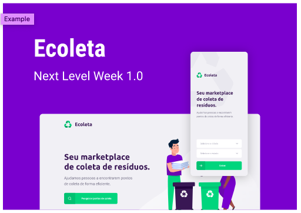

<h1 align="center">
    
</h1>

## What's Next Level Week?

NLW is a week with lots of challenges, code and networking, made by Rocketseat.
The objective is to learn about new tools and new technologies that will boost your career.
An online and completely free event that will help you go to the next level in your evolution as a dev.

## Project

Ecoleta is a project developed based on international environment week. 
That aims to connect people to companies that collect specific waste such as light bulbs, batteries, cooking oil, etc.

<h1 align="center">
    
</h1>

## Technologies

This project was developed with the following technologies:

- Node.js
- TypeScript
- React
- Express
- SQLite / Knex
- Leaflet
- Rest
- Axios
- Expo

---

<h4 align="center">
    <a href="https://www.linkedin.com/in/guilherme-raguzzoni-b3566396/" target="_blank">Guilherme Raguzzoni</a>
</h4>
